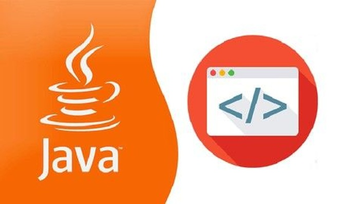

<h1 align="center">Yazılım Geliştirici Yetiştirme Kampı (JAVA + REACT)</h1>

    

### Table of Contents
- [Description](#description)
- [Dependencies](#spring-boot)
- [SQL Query](#sql-query)
- [Author Info](#author-info)

---

## Description

- This project is a Products-Management project. It was developed thanks to the education of Engin Demiroğ.
- In this project, we used postgreSql for the database.

#### Technologies

- [Spring Boot](https://spring.io/projects/spring-boot)
- [Project Lombok](https://projectlombok.org/)

---

## Spring Boot

#### Dependencies

- Spring Boot DevTools
- Lombok
- Spring Web
- Spring Data JPA
- PostgreSQL Driver

---

## 🗃 SQL Query

📃 [northwind.sql](https://github.com/Dogukanyllmaz/recapDemo-Northwind/blob/main/northwind.sql) 

---

## Author Info

- 💻 [LinkedIn](https://www.linkedin.com/in/hüseyin-doğukan-yılmaz-75a1531ab/)

- 🎫 [Email](mailto:dogu_codem@hotmail.com?subject=[GitHub]%20Source%20Han%20Sans)
